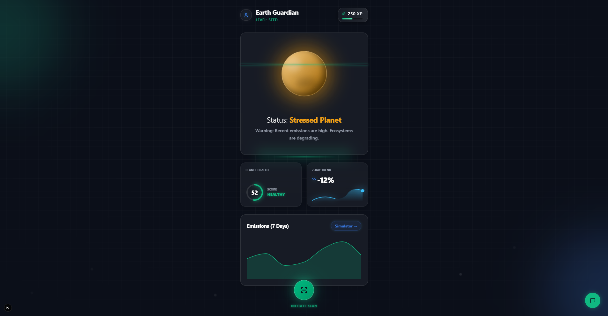
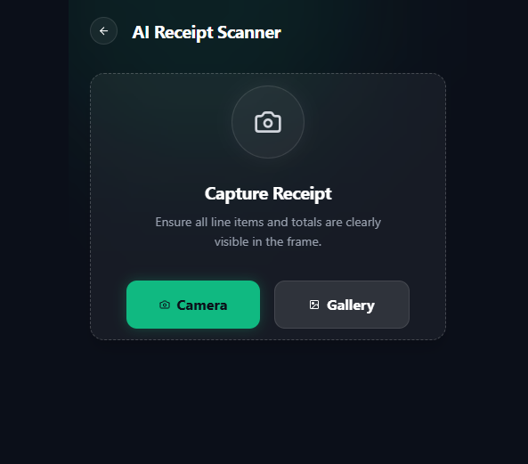
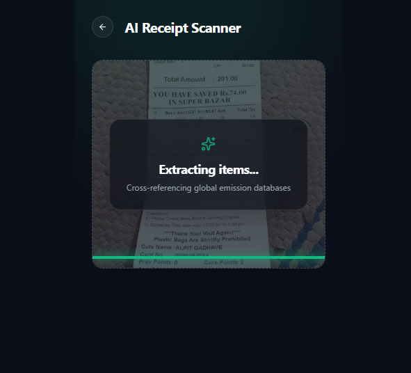
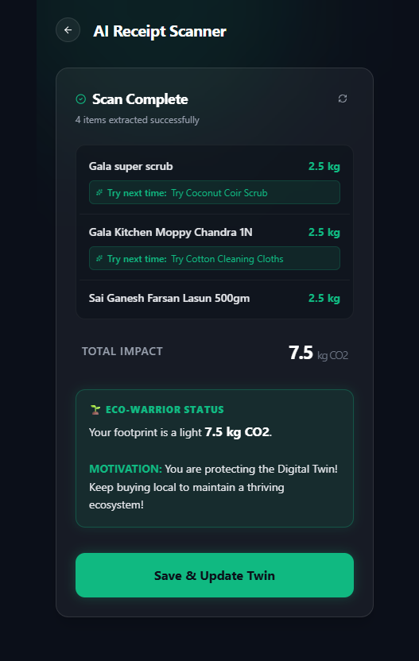

<div align="center">

# 🌍 Earth Guardian AI
**Your Digital Twin for Sustainable Living.**

[](https://nextjs.org/)
[](https://fastapi.tiangolo.com/)
[](https://spring.io/)
[](https://ai.google.dev/)

*Transforming everyday purchases into planetary action through AI-driven receipt scanning and gamified sustainability.*

---







</div>

## 🚀 The Vision
In the fight against climate change, awareness isn't enough—action is required. **Earth Guardian AI** bridges the gap between daily consumer habits and global carbon emissions. By uploading a simple grocery receipt, our AI instantly analyzes your carbon footprint, suggests eco-friendly alternatives, and dynamically updates your **Planetary Digital Twin**. 

Will your digital world flourish with greenery, or wither under high emissions? The choice is in your cart.

## ✨ Key Features
- 📸 **AI Receipt Scanner**: Upload any shopping receipt. Our FastAPI microservice uses Gemini Vision AI to extract items, calculate carbon metrics, and suggest sustainable alternatives (e.g., swapping Beef for Plant-Based Mince).
- 🌐 **Holographic Digital Twin**: A stunning, interactive 3D dashboard built with Framer Motion. Your "Planet Health" visually degrades or heals based on your real-world shopping data.
- 🎮 **Gamification Engine**: Earn XP and level up (from *Seed* to *Guardian*) by making low-carbon choices. Powered by a robust Spring Boot backend.
- 🤖 **Eco-Chatbot**: A floating AI assistant ready to provide contextual, actionable sustainability tips on any screen.
- 📊 **Carbon Simulation**: Predictive modeling to see how changing one habit can drastically alter your 7-day emission trajectory.

## 💻 Tech Stack
We built Earth Guardian AI using a modern, scalable polyglot architecture:
*   **Frontend**: Next.js 14, React, Tailwind CSS, Framer Motion, Recharts, Lucide Icons.
*   **AI Gateway**: FastAPI, Python, Pydantic, Google Gemini / OpenAI SDK.
*   **Core Engine**: Spring Boot 3.3, Java, Spring Data JPA, Maven.

## 🛠️ Quick Start (Hackathon Judging)

Want to run Earth Guardian AI locally? It requires running three services:

### 1. The Frontend (Next.js)
```bash
cd Frontend
npm install
npm run dev
# Running on http://localhost:3000
```

### 2. The AI Gateway (FastAPI)
```bash
cd Backend/fastapi
pip install -r requirements.txt
uvicorn app.main:app --reload --port 8000
# Running on http://localhost:8000
```

### 3. The Core Engine (Spring Boot)
```bash
cd Backend/springboot
mvn spring-boot:run
# Running on http://localhost:8080
```

> **Note:** Ensure you have your `.env` variables configured for your AI API keys in the FastAPI directory before scanning!

## 📱 Dashboard Aesthetics
Our dashboard isn't just a UI—it's a sci-fi command center. It features:
*   Real-time **SVG Radial Gauges** and **Neon Sparkline Charts**.
*   A **Holographic Scanline Emitter** underlying the Digital Twin.
*   Immersive glass-morphism and interactive particle physics.

## 🤝 The Hackathon Journey
Built under extreme pressure, Earth Guardian AI demonstrates the power of combining AI Vision with robust enterprise backends. We conquered React hydration errors, complex prompt engineering, and cross-origin resource sharing to deliver a polished, production-ready MVP.

---
<div align="center">
Made with 💚 for the Planet.
</div>
